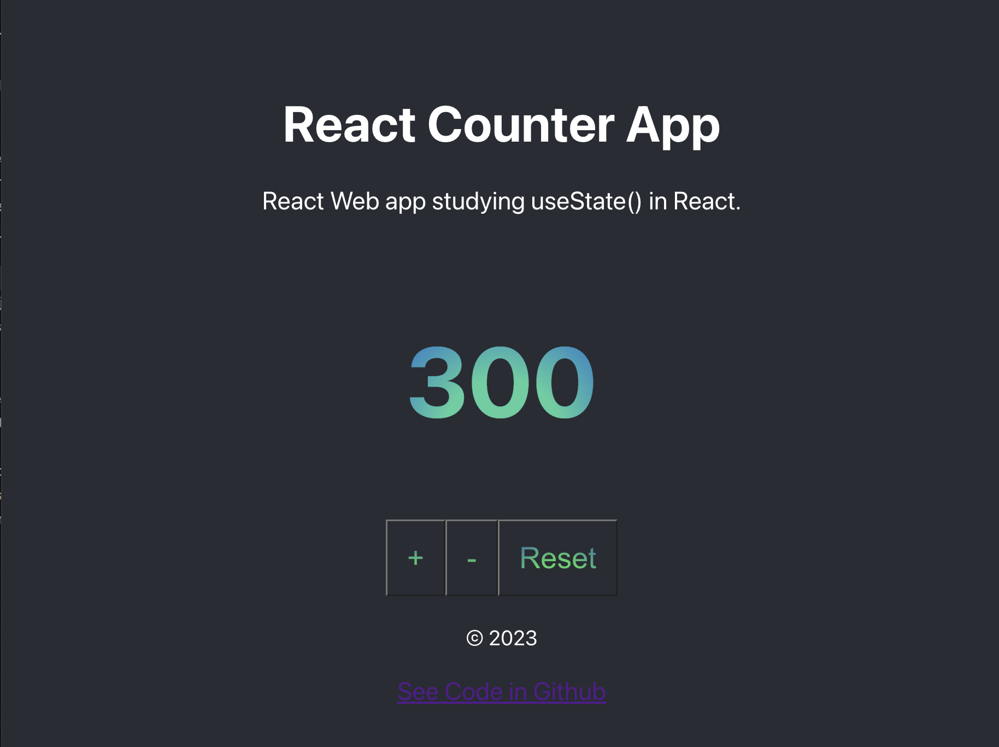

# React Counter App

Boca Code Week 4 React Counter App: This project is a React Counter App that focuses on practicing the useState() hook in React. It allows users to increment, decrement, and reset a displayed number.

## Project Structure

The project consists of the following components:

- **App.js**: The main component that renders the app.
- **Header.js**: Renders the header section of the app, providing a title and description.
- **Counter.js**: Implements the counter functionality using the useState() hook.
- **Footer.js**: Displays the footer section, including a link to the project's GitHub repository.

## Technologies Used

- HTML
- CSS
- React

## Getting Started

To run the React Counter App locally, follow these steps:

1. Clone the repository from [GitHub](https://github.com/v-cazeau/react-counter-app).

2. Install the necessary dependencies using `npm install`.

3. Run the app using `npm start`.

## Usage

Once the app is running, you will see the counter section with an initial value of 0. You can interact with the app using the following buttons:

- **"+"**: Increments the displayed number by 100.
- **"-"**: Decrements the displayed number by 200.
- **"Reset"**: Resets the displayed number to 0.

## Special Thanks

- [Boca Code](https://github.com/bocacode)

---
*This project was developed as part of the Boca Code curriculum.*